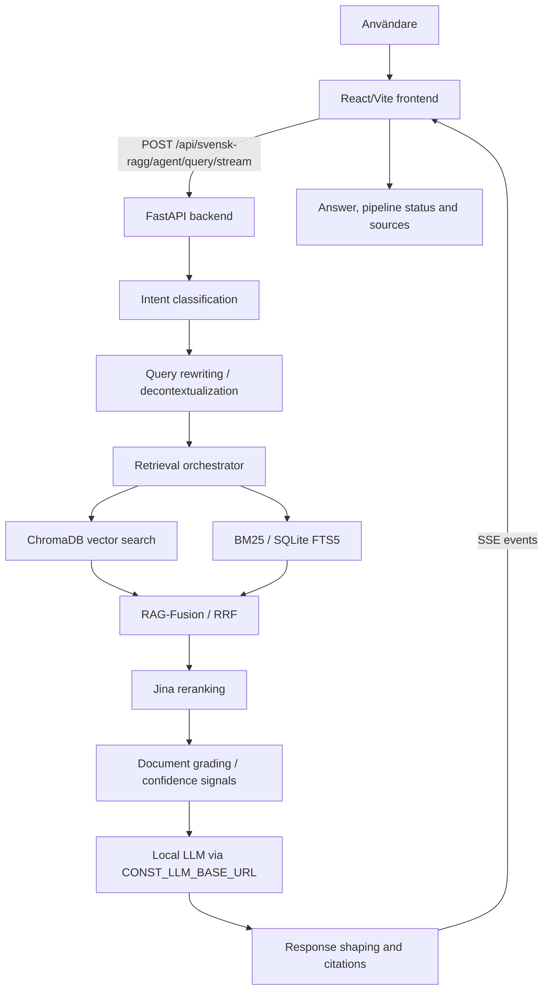

<div align="center">

# RAG-system för svenska offentliga dokument

### Svensk Ragg - personligt lärande- och portföljprojekt

[](https://github.com/itsimonfredlingjack/rag-project/actions/workflows/ci.yml)
[](LICENSE)
[](https://www.python.org/)
[](https://fastapi.tiangolo.com/)
[](https://react.dev/)

**Inte en produkt. Inte en publik tjänst. Ett tekniskt portföljcase.**

</div>

---

Det här repot visar ett end-to-end RAG-system byggt för svenska offentliga dokument. Detta är ett långvarigt personligt lärande- och portföljprojekt som utvecklats stegvis genom flera omgångar av experimenterande, ombyggnation, utvärdering och förfining.

Projektets centrala tekniska fråga har varit:
**Hur kapabelt kan ett lokalt RAG-system bli när det arbetar med mycket stora svenska dokumentsamlingar på vanlig konsumenthårdvara – specifikt en konsument-GPU med 12 GB VRAM – istället för moln- eller frontier-skalig infrastruktur?**

Systemet tar en fråga, hämtar relevanta källor, bedömer dem och genererar ett lokalt källhänvisat svar. Målet har varit att utforska lokal AI, retrievalkvalitet i stor skala och källförankrade svar.


_Screenshoten visar en tidigare lokal körning av frontendens källpanel. Full lokal retrieval kräver data och modeller som inte ingår i repot._

---

## Datakorpus, Historik och Offentlig Release

Det är viktigt att göra en tydlig åtskillnad mellan vad systemet har testats på historiskt i en privat miljö och vad som faktiskt distribueras:

1. **Den publika demon / releasen:** Den nedladdningsbara publika korpusen innehåller enbart material som är lagligt och avsett för publik vidaredistribution. För närvarande består detta av öppen data från Riksdagen, specifik baserad på ca 230 143 dokumentrader (verifierat från release-manifestet och script-konfigurationen).
2. **Historiska privata experiment:** Tidigare lokala labb-experiment nådde upp till cirka 1,37 miljoner indexerade poster. Denna större privata korpus innehöll även metadata från DiVA och annat svenskt material.
3. **Ingen distribution av privat data:** Den historiska privata korpusen, DiVA-poster, ChromaDB-data, råa dokument, PDF-cachar och privata index distribueras **inte** genom detta repo eller dess publika releaser. DiVA har endast använts i de historiska lokala experimenten, och DiVA-korpusen i sig är inte publicerad här.

## Projektets Syfte och Begränsningar

Detta projekt är:
- Ett tekniskt lärande- och portföljprojekt.
- En utforskning av lokal AI, retrievalkvalitet, skala och källförankrade svar på begränsad hårdvara.

Detta projekt är **inte**:
- En färdig kommersiell produkt.
- Avsett att konkurrera med någon publik söktjänst.
- En personuppgifts- eller juridisk registertjänst.
- En kommersiell dokumentdatabas.

## Teknisk Översikt och Lärdomar

Projektet har experimenterat med olika lokala språkmodeller (till exempel via Ollama med `gemma4:e2b` i den publika demon) och en flerstegs RAG-pipeline. För att maximera kvaliteten lokalt utförs *iterativ pipeline-tuning*, *retrieval-optimering* samt *prompt- och kontextoptimering* snarare än viktuppdaterande fine-tuning av modellerna.

Pipelinen kombinerar på lämpligt sätt:
- Vektor- och sparse retrieval
- BM25
- Query rewriting (omskrivning av frågor)
- RAG-Fusion / reciprocal rank fusion (RRF)
- Reranking
- Dokumentgradering och konfidenssignaler (confidence signals)
- Källurval och citeringar
- Prompt- och kontextoptimering
- Utvärdering (evaluation) och regressionstestning
- Critic/revision eller liknande experimentella kvalitetssteg (där de är aktiverade)

| Del | Teknik |
|-----|--------|
| Backend | FastAPI, Uvicorn, Pydantic v2 |
| Frontend | React 19, TypeScript, Vite, Tailwind CSS |
| Vector DB | ChromaDB, lokal persistent lagring |
| Sparse search | BM25 via SQLite FTS5 |
| Embeddings | `jinaai/jina-embeddings-v3` |
| Reranking | `jinaai/jina-reranker-v2-base-multilingual` |
| Lokal LLM | Konfigurerad via `CONST_LLM_BASE_URL` |
| Pipeline | RAG-Fusion/RRF, CRAG-inspirerad gradering, BM25 |
| CI | GitHub Actions: docs-check, pytest, ruff, eslint, etc. |

## Arkitektur



Se [docs/ARCHITECTURE.md](docs/ARCHITECTURE.md) för mer teknisk detalj.

## Repo-Karta

```text
rag-project/
├── backend/                         FastAPI-backend, services, API-routes och tester
├── apps/svensk-ragg-frontend/       React/TypeScript/Vite-frontend
├── eval/                            Eval-skript, testfrågor och retrieval-analyser
├── backend/eval/                    Backendnära eval-dataset och körskript
├── indexers/                        Skript för ChromaDB-indexering
├── scripts/                         Publika corpusbyggare samt CI-/repo-kontroller
├── scrapers/                        Scrapers för offentliga svenska dokumentkällor
├── docs/                            Publik dokumentation och screenshots
└── .github/workflows/               CI för docs, backend och frontend
```

## Kom Igång

Se [docs/QUICK_START.md](docs/QUICK_START.md) för en kortare körguide och detaljer om backend/frontend-setup.

Backenden kan starta utan privat corpus, men full privat RAG-retrieval kräver att `CONST_CHROMADB_PATH` pekar på ett lokalt ChromaDB-index och att en lokal LLM-runtime är igång. Den publika Riksdagen-demoprofilen (`CONST_PROFILE=public-riksdag-demo`) använder public BM25 och en konfigurerad LLM.

### Tester
```bash
cd backend
python -m pytest tests/ -v -m "not integration and not ollama and not slow" --tb=short
```

## Dokumentation

| Dokument | Innehåll |
|----------|----------|
| [docs/PORTFOLIO_CASE.md](docs/PORTFOLIO_CASE.md) | Kort case-sida för snabb överblick |
| [docs/QUICK_START.md](docs/QUICK_START.md) | Lokal snabbstart |
| [docs/ARCHITECTURE.md](docs/ARCHITECTURE.md) | Teknisk arkitektur och pipeline |
| [docs/TESTING_GUIDE.md](docs/TESTING_GUIDE.md) | Teststrategi och körkommandon |
| [apps/svensk-ragg-frontend/README.md](apps/svensk-ragg-frontend/README.md) | Frontend |

## Licens

MIT - se [LICENSE](LICENSE).
