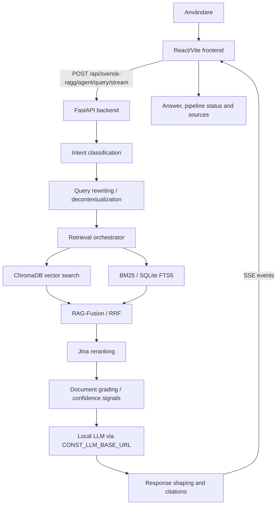

<div align="center">

# RAG-system för svenska offentliga dokument

### Svensk Ragg - personligt lärande- och portföljprojekt

[](https://github.com/itsimonfredlingjack/rag-project/actions/workflows/ci.yml)
[](LICENSE)
[](https://www.python.org/)
[](https://fastapi.tiangolo.com/)
[](https://react.dev/)

**Inte en produkt. Inte en publik tjänst. Ett tekniskt portföljcase.**

</div>

---

Det här repot visar ett end-to-end RAG-system byggt för svenska offentliga dokument. Projektet är ett personligt lärandeprojekt som knyter ihop datainsamling, indexering, hybrid retrieval, lokal LLM-inferens, källhänvisade svar, backend, frontend, tester och CI.

Målet är att visa praktisk förståelse för hur ett RAG-system faktiskt sätts ihop: från dokumentkorpus och retrieval-strategier till osäkerhet, källurval, streaming och användargränssnitt.


_Screenshoten visar en tidigare lokal körning av frontendens källpanel. Full lokal retrieval kräver ChromaDB-/BM25-data och LLM-runtime som inte ingår i repot._

---

## Vad Projektet Visar

- End-to-end RAG-flöde: fråga, retrieval, reranking, generation och källvisning.
- Hybrid retrieval med ChromaDB-vektorsökning och BM25/SQLite FTS5.
- Lokal LLM-integration via konfigurerad `CONST_LLM_BASE_URL`.
- Källhänvisade svar och frontendpanel för källor/citations.
- FastAPI-backend med SSE-streaming till React/TypeScript/Vite-frontend.
- Eval- och teststruktur för retrieval, prompts, API-kontrakt och pipelinebeteende.
- GitHub Actions för docs-check, backendtester och frontend lint/build.
- Praktisk hantering av retrievalkvalitet, avgränsningar, osäkerhet och hallucinationsrisk.

## Vad Det Inte Är

- Inte en färdig produkt eller en publik tjänst.
- Inte en komplett eller auktoritativ databas över svenska offentliga dokument.
- Inte ett löfte om juridiskt korrekta svar.
- Inte en distribuerad demo med färdig ChromaDB, BM25-index eller modellvikter.
- Inte ett benchmarkat system med verifierade precision-/recall-värden i detta repo.

Lokala datavolymer som nämns i projektet beskriver en tidigare projektmiljö, inte data som följer med repot. Bygger du ett eget corpus kan antal dokument, lagringsstorlek och resultat skilja sig mycket.

## Teknisk Översikt

| Del | Teknik |
|-----|--------|
| Backend | FastAPI, Uvicorn, Pydantic v2 |
| Frontend | React 19, TypeScript, Vite, Tailwind CSS |
| 3D/UI | Three.js, React Three Fiber, Drei, Framer Motion |
| Vector DB | ChromaDB, lokal persistent lagring |
| Sparse search | BM25 via SQLite FTS5 |
| Embeddings | `jinaai/jina-embeddings-v3` |
| Reranking | `jinaai/jina-reranker-v2-base-multilingual` |
| Lokal LLM | Konfigurerad via `CONST_LLM_BASE_URL` (till exempel Ollama eller llama-server) |
| Pipeline | Retrieval orchestration, RAG-Fusion/RRF, CRAG-inspirerad gradering |
| Streaming | Server-Sent Events från backend till frontend |
| CI | GitHub Actions: docs-check, pytest, ruff, mypy, eslint, TypeScript build |

## Arkitektur



Se [docs/ARCHITECTURE.md](docs/ARCHITECTURE.md) för mer teknisk detalj.

## Repo-Karta

```text
rag-project/
├── backend/                         FastAPI-backend, services, API-routes och tester
├── apps/svensk-ragg-frontend/   React/TypeScript/Vite-frontend
├── eval/                            Eval-skript, testfrågor och retrieval-analyser
├── backend/eval/                    Backendnära eval-dataset och körskript
├── indexers/                        Skript för ChromaDB-indexering
├── scripts/                         Pipeline-, BM25-, reindexerings- och utility-skript
├── scrapers/                        Scrapers för offentliga svenska dokumentkällor
├── docs/                            Publik dokumentation och screenshots
└── .github/workflows/               CI för docs, backend och frontend
```

## Datakorpus Och Begränsningar

Projektet har utvecklats mot en större lokal korpus av svenska offentliga dokument. I tidigare lokal miljö har dokumentationen beskrivit ungefär 1,37M indexerade poster, inklusive myndighets-/riksdagsmaterial och DiVA-metadata. Den siffran ska läsas som historik från utvecklingsmiljön, inte som något som kan verifieras direkt efter klon.

Det som finns i repot är kod, dokumentation, testdata och eval-struktur. Det som inte finns i repot är:

- ChromaDB-data.
- BM25/FTS5-index.
- Lokala modellvikter.
- PDF-cache eller skrapad rådata.
- Lokala secrets, tokens eller runtimefiler.

Det största lärandet i projektet är att kvaliteten i ett RAG-system avgörs lika mycket av retrieval, källurval, avgränsningar och eval som av modellen.

## Kom Igång

Se även [docs/QUICK_START.md](docs/QUICK_START.md) för en kortare körguide.

### Backend

```bash
cd backend
python -m venv .venv
source .venv/bin/activate
python -m pip install --upgrade pip
pip install -r requirements.txt
cp .env.example .env
uvicorn app.main:app --host 127.0.0.1 --port 8900
```

Health check:

```bash
curl http://127.0.0.1:8900/api/svensk-ragg/health
```

Readiness check:

```bash
curl http://127.0.0.1:8900/api/svensk-ragg/ready
```

Backenden kan starta utan privat corpus, men full privat RAG-retrieval kräver att `CONST_CHROMADB_PATH` pekar på ett lokalt ChromaDB-index och att en lokal LLM-runtime är igång. Den publika Riksdagen-demoprofilen (`CONST_PROFILE=public-riksdag-demo`) använder public BM25 och `gemma3:4b`; operator-/legacy-ytor som `/mcp`, `/sse`, `/ws/harvest`, och generated docs är avstängda där som standard.

### Frontend

```bash
cd apps/svensk-ragg-frontend
npm ci
npm run lint
npm run build
npm run dev
```

Frontend kör normalt på `http://localhost:3003` och använder `VITE_BACKEND_URL` för att hitta backend. Se [apps/svensk-ragg-frontend/README.md](apps/svensk-ragg-frontend/README.md).

### Tester

```bash
cd backend
python -m pytest tests/ -v -m "not integration and not ollama and not slow" --tb=short
```

Integrationstester och LLM-tester kräver lokala tjänster och körs bara när motsvarande miljö finns.

## Dokumentation

| Dokument | Innehåll |
|----------|----------|
| [docs/PORTFOLIO_CASE.md](docs/PORTFOLIO_CASE.md) | Kort case-sida för snabb överblick |
| [docs/QUICK_START.md](docs/QUICK_START.md) | Lokal snabbstart utan privat databas |
| [docs/ARCHITECTURE.md](docs/ARCHITECTURE.md) | Teknisk arkitektur och pipeline |
| [docs/TESTING_GUIDE.md](docs/TESTING_GUIDE.md) | Teststrategi och körkommandon |
| [apps/svensk-ragg-frontend/README.md](apps/svensk-ragg-frontend/README.md) | Frontendens körning, miljövariabler och komponenter |

## Licens

MIT - se [LICENSE](LICENSE).
