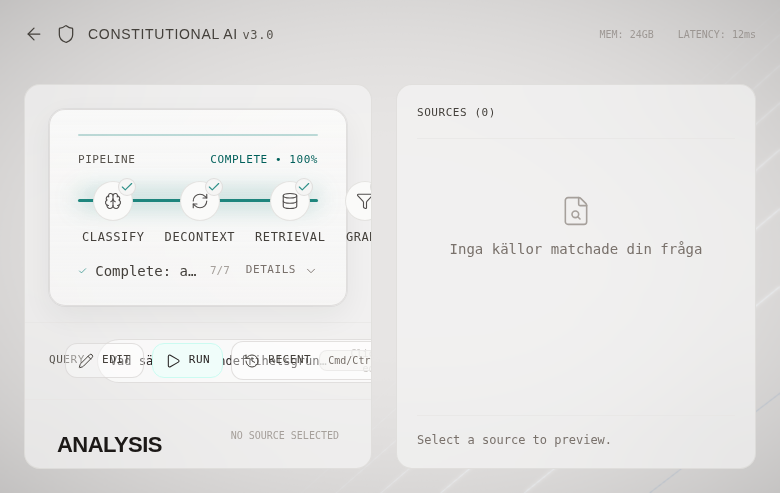
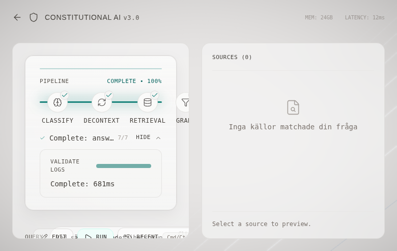
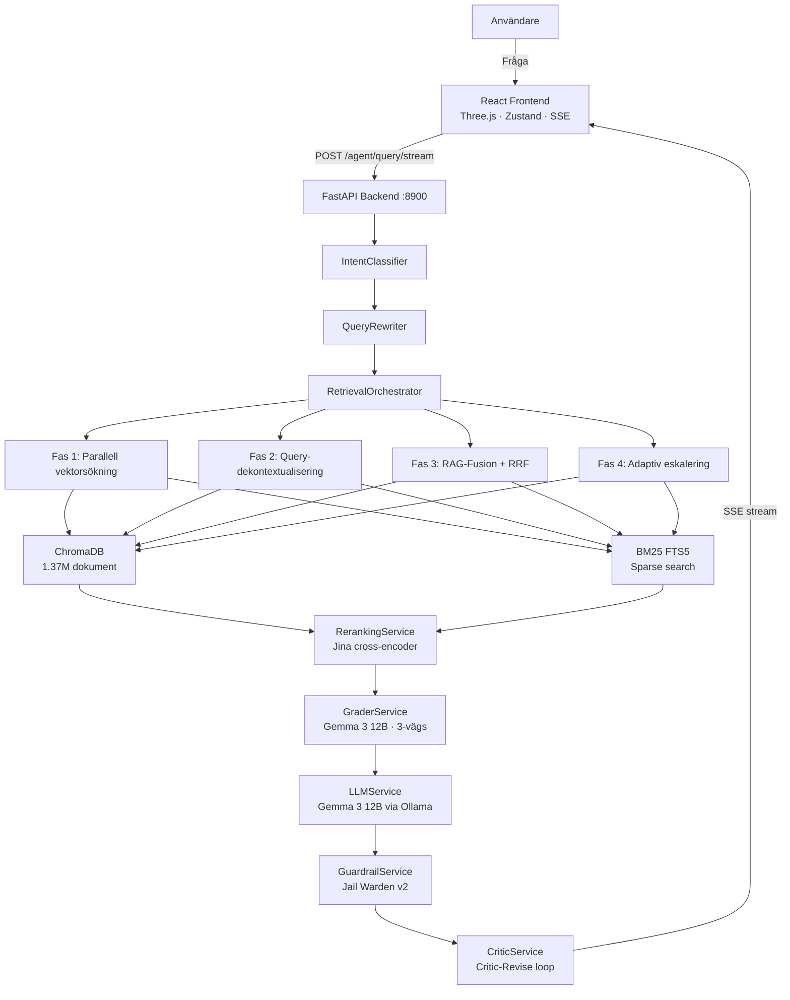

<div align="center">

# Constitutional AI

### RAG-system för svenska myndighetsdokument

[](https://github.com/itsimonfredlingjack/rag-project/actions/workflows/ci.yml)
[](LICENSE)
[](https://www.python.org/)
[](https://fastapi.tiangolo.com/)
[](https://react.dev/)
[](https://www.trychroma.com/)

**Personligt lärande- och portföljprojekt** — inte en produkt eller tjänst.

</div>

---

Jag byggde det här för att lära mig end-to-end hur ett modernt RAG-system fungerar i praktiken: från datainsamling och vektorindexering till LLM-inferens och streaming-svar. Allt körs lokalt på en RTX 4070 — inga molntjänster, inga abonnemangskostnader.

**Vad det gör:** tar en fråga på svenska → hämtar relevanta stycken ur 1,37 miljoner svenska myndighetsdokument → genererar ett källhänvisat svar med en lokal LLM (Gemma 3 12B via Ollama).




---

## Varför jag byggde det

Jag ville ha ett konkret projekt som demonstrerar att jag kan navigera ett komplext tekniklandskap med verkliga trade-offs: vektordatabaser, LLM-inferens, streaming-API:er och 30+ datakällor. Inte en tutorial — ett fungerande system som jag itererat på under flera månader.

## Vad som funkar — och vad som är experiment

✅ **Fungerar:** Pipeline end-to-end (fråga → hämtning → svar med källhänvisningar), SSE-streaming till React-frontend, CRAG-dokumentgradering (relevant/ambiguous/irrelevant), hybrid-sökning BM25 + vektor, eval-ramverk med 50+ testfiler.

⚠️ **Halvfärdigt / under iteration:** Guardrail-systemet (Jail Warden v2) är grovkalibrerat — EVIDENCE-läget blockerar ~40 % av legitima svar. Critic-Revise-loopen är implementerad men sällan aktiverad i praktiken.

❌ **Inte inkluderat i repot:** ChromaDB-datan (57 GB) körs lokalt och finns inte i git.

---

## Arkitektur



---

## Repo-struktur

```
rag-project/
├── backend/                    # FastAPI RAG-backend
│   ├── app/
│   │   ├── api/                # Routes (constitutional, document)
│   │   ├── services/           # 33 service-moduler
│   │   │   ├── orchestrator_service.py
│   │   │   ├── retrieval_orchestrator.py
│   │   │   ├── llm_service.py
│   │   │   └── ...
│   │   ├── core/               # Auth, rate limiting, error handling
│   │   └── config.py           # Pydantic settings (CONST_-prefix)
│   └── tests/                  # 50+ testfiler (pytest)
│
├── apps/
│   └── konstitutionell-frontend/   # React 19 + Three.js + Tailwind
│       └── src/
│           ├── components/3d/      # Three.js pipeline-visualisering
│           └── components/ui/      # Chat, citations, source panel
│
├── scrapers/                   # Web scrapers, 30+ myndigheter
│   ├── myndigheter/            # Per-myndighets scrapers (40 filer)
│   ├── kommuner/               # Kommunala dokument
│   └── akademi/                # DiVA OAI-PMH harvesting
│
├── indexers/                   # ChromaDB-indexeringsskript
├── eval/                       # RAGAS + retrieval quality evaluation
├── scripts/                    # Data pipeline utilities
├── docs/                       # Teknisk dokumentation
│   └── assets/                 # Screenshots
├── systemd/                    # Systemd user services
└── docker-compose.yml
```

---

## Vad jag lärde mig

- **RAG-pipeline i djupet:** vektorsökning (ChromaDB + Jina Embeddings v3, 1024-dim), BM25 sparse search, Reciprocal Rank Fusion
- **CRAG-mönstret:** dokumentgradering + self-reflection för att minska hallucinationer
- **Lokal LLM-inferens:** quantiserade modeller (Q4_K_M), context-hantering, GPU-minnesbegränsningar med RTX 4070 12 GB
- **Systemdesign i skala:** ~1,37M vektorer, 33 tjänstemodulor, LangGraph state machine, SSE-streaming
- **Datainsamling i praktiken:** web-scrapers för 30+ myndigheter, OAI-PMH-harvesting för DiVA-forskning (829K akademiska publikationer)

---

## Tech Stack

### Backend (Python 3.12)

| Komponent | Teknik |
|-----------|--------|
| API | FastAPI 0.109+, Uvicorn, Pydantic v2 |
| Vector DB | ChromaDB (~57 GB, 1,37M+ dokument) |
| Embeddings | jinaai/jina-embeddings-v3 (1024 dim, asymmetrisk encoding) |
| Reranker | jinaai/jina-reranker-v2-base-multilingual (cross-encoder, 278M params) |
| LLM | Gemma 3 12B Q4_K_M (~8 GB) via Ollama |
| Pipeline | LangGraph (CRAG med relevance grading + self-reflection) |
| Sparse search | BM25 (SQLite FTS5) |
| Fusion | RAG-Fusion med Reciprocal Rank Fusion |
| Hallucinationsskydd | Jail Warden v2 (guardrail service) |

### Frontend (TypeScript)

| Komponent | Teknik |
|-----------|--------|
| UI | React 19, TypeScript 5.9, Vite 7 |
| 3D | Three.js 0.182 via React Three Fiber 9 |
| Styling | Tailwind CSS 4, Framer Motion 12 |
| State | Zustand 5 |

### Infrastruktur

| Komponent | Teknik |
|-----------|--------|
| Hosting | Self-hosted, RTX 4070 12 GB VRAM |
| LLM-runtime | Ollama port 11434 |
| Process | 3 systemd user services |
| CI/CD | GitHub Actions — ruff, mypy, pytest, eslint, tsc |

---

## Kom igång

### Förutsättningar

- Python 3.12+, Node.js 20+
- [Ollama](https://ollama.ai) med `gemma3:12b` nedladdat: `ollama pull gemma3:12b`
- ChromaDB-data (inte inkluderat — se `indexers/` för att bygga eget corpus)

### Backend

```bash
cd backend
python -m venv venv && source venv/bin/activate
pip install -r requirements.txt
cp .env.example .env
uvicorn app.main:app --host 0.0.0.0 --port 8900
```

### Frontend

```bash
cd apps/konstitutionell-frontend
npm install
npm run dev          # http://localhost:3003
```

### Tester

```bash
cd backend
pytest tests/ -v -m "not integration and not slow"       # snabbkörning
RUN_INTEGRATION_TESTS=1 pytest -m integration            # integrationstester
RUN_OLLAMA_TESTS=1 pytest -m ollama                      # kräver Ollama
```

### API

Swagger UI: `http://localhost:8900/docs`

| Metod | Route | Syfte |
|-------|-------|-------|
| GET | `/api/constitutional/health` | Hälsokontroll |
| GET | `/api/constitutional/ready` | Djup readiness-check |
| POST | `/api/constitutional/agent/query` | RAG-fråga (JSON) |
| POST | `/api/constitutional/agent/query/stream` | RAG-fråga (SSE) |
| POST | `/api/constitutional/search` | Dokumentsökning |

---

## Konfiguration

Alla miljövariabler prefixade med `CONST_` via `backend/app/config.py`:

| Variabel | Default | Syfte |
|----------|---------|-------|
| `CONST_PORT` | 8900 | Backend-port |
| `CONST_LLM_BASE_URL` | `http://localhost:11434` | Ollama URL |
| `CONST_CRAG_ENABLED` | false | Aktivera CRAG |
| `CONST_CRAG_ENABLE_SELF_REFLECTION` | false | CRAG self-reflection |
| `CONST_DEBUG` | false | Debug-läge |

---

## Dokumentation

| Dokument | Innehåll |
|----------|----------|
| [ARCHITECTURE.md](docs/ARCHITECTURE.md) | Systemarkitektur |
| [QUICK_START.md](docs/QUICK_START.md) | Snabbstart |
| [DEPLOYMENT.md](docs/DEPLOYMENT.md) | Driftsättning |
| [MODEL_OPTIMIZATION.md](docs/MODEL_OPTIMIZATION.md) | LLM-tuning |
| [TESTING_GUIDE.md](docs/TESTING_GUIDE.md) | Teststruktur |
| [PERFORMANCE_ANALYSIS.md](docs/PERFORMANCE_ANALYSIS.md) | Benchmarks |

---

## Licens

MIT — se [LICENSE](LICENSE).
