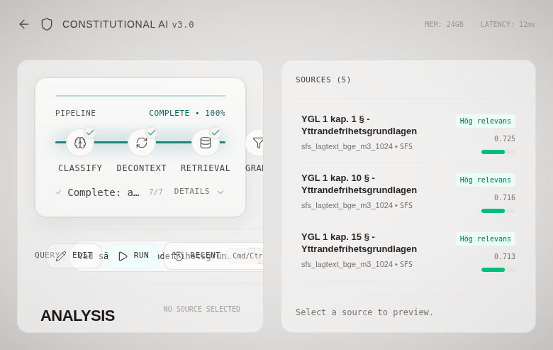

# Portfolio Case: RAG-system för svenska offentliga dokument

## Problem

Svenska offentliga dokument är ofta utspridda över myndigheter, riksdagsmaterial, lagtext, rapporter och akademiska metadata. Ett vanligt RAG-problem är därför inte bara att generera text, utan att hitta rätt underlag, visa källor och hantera när systemet inte har tillräckligt stöd.

Det här projektet byggdes som ett personligt lärande- och portföljcase för att förstå den praktiska kedjan från dokumentinsamling och indexering till retrieval, backend, frontend, testning och driftbarhet.

## Lösning

Systemet tar en fråga på svenska, hämtar möjliga källor från lokala index, rankar och väger dem, och streamar ett svar till frontend tillsammans med pipeline-status och källpanel.

Projektet visar särskilt:

- Hybrid retrieval: ChromaDB-vektorsökning och BM25/SQLite FTS5.
- Lokal LLM-integration via backendkonfiguration.
- Reranking och confidence-/graderingssteg före svarsgenerering.
- React-frontend med fråga, svar, pipelinevy och källpanel.
- Eval- och testfrågor för att resonera om retrievalkvalitet och regressionsrisk.

## Teknik

| Lager | Huvudkomponenter |
|-------|------------------|
| Frontend | React 19, TypeScript, Vite, Tailwind, Three.js |
| API | FastAPI, Pydantic, SSE-streaming |
| Retrieval | ChromaDB, BM25/SQLite FTS5, RAG-Fusion/RRF |
| ML | Jina embeddings, Jina reranker, lokal LLM-runtime |
| Test/CI | pytest, ruff, mypy, eslint, TypeScript build, GitHub Actions |

## Vad Som Går Att Verifiera I Repot

- Backendens API-kontrakt, servicestruktur och en stor del av testsviten.
- Frontendens byggbarhet, lintning och koppling mot `VITE_BACKEND_URL`.
- RAG-pipelinekomponenter som retrieval orchestration, BM25-service, reranking- och promptlager.
- Evalstruktur, testfrågor och tidigare eval-resultat som projektartefakter.
- GitHub Actions för docs-check, backendtester och frontend build/lint.

Full retrieval med verkliga svar kräver däremot lokal ChromaDB-/BM25-data och en lokal LLM-runtime. Dessa ingår inte i repot.

## Begränsningar

- Repot är inte en publik tjänst och ska inte behandlas som en färdig produkt.
- ChromaDB-data, BM25-index, PDF-cache, modellvikter och lokala runtimefiler är exkluderade.
- Dokumentantal i äldre projektanteckningar beskriver en lokal utvecklingsmiljö och behöver verifieras på nytt om systemet återskapas.
- Projektet innehåller experimentella delar för gradering, guardrails och critic/revise-flöden. De ska läsas som implementationer att lära av, inte som garanterat hallucinationsskydd.
- Juridiska svar från systemet ska aldrig betraktas som auktoritativ rådgivning.

## Screenshots

Screenshots ovan kommer från tidigare lokal körning. De visar frontendens sätt att presentera källor och pipeline-status, men repot innehåller inte den lokala databas som krävs för att reproducera samma fråga direkt efter klon.

## Lärdomar

Det viktigaste lärandet var att RAG-kvalitet inte sitter i en enda modell. Retrievalstrategi, dokumentstruktur, metadata, källurval, fallbackbeteende, evalfrågor och ärlig osäkerhet avgör lika mycket som själva LLM:en.

Det här repot är därför mest värdefullt som ett tekniskt case: det visar hur många praktiska lager som behöver fungera tillsammans för att bygga ett seriöst, källbaserat AI-flöde.
